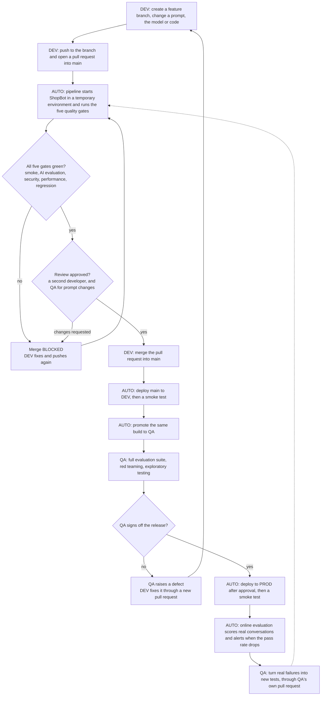
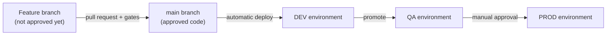
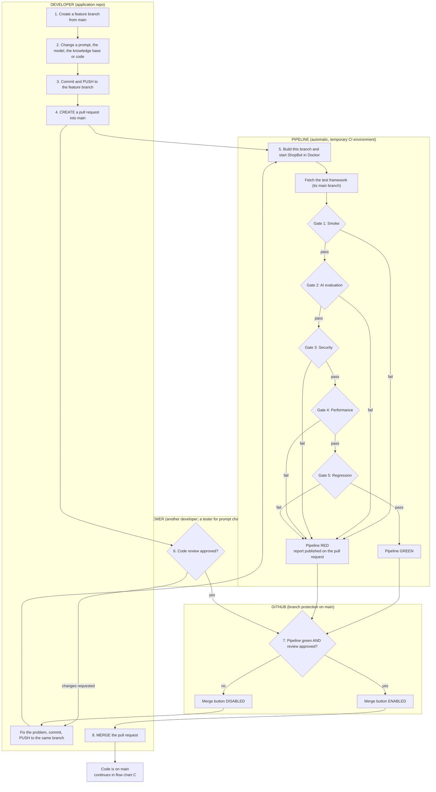
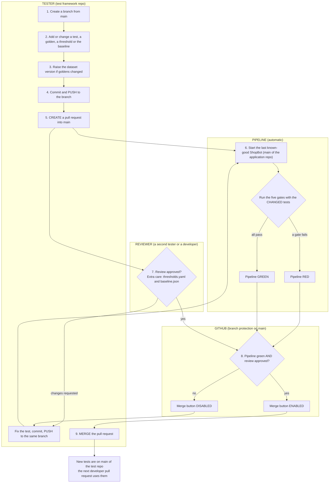
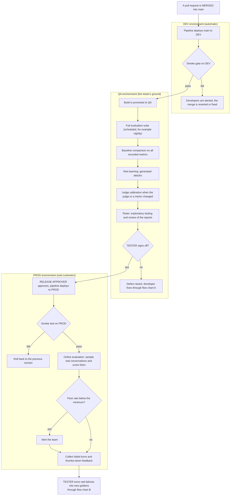

# CI/CD architecture: how quality gates stop a change from reaching `main`

This document describes the CI/CD design for ShopBot and its test automation framework: who pushes, who opens and merges a pull request, where the quality gates sit, and how a change travels from a developer's laptop to production.

**Read this first: it is the target design.** It shows how a real team would run this framework. Section 9 lists what exists in the project today and what does not. Do not describe the target as already running.

Related documents: the framework itself is explained in [FRAMEWORK_GUIDE.md](FRAMEWORK_GUIDE.md). The five gates and the checklist for switching on the merge block are in its sections 9.3 and 9.4.

---

## The whole flow in one chart

If you read only one chart, read this one. Each step names who does it: the developer (DEV), the tester (QA) or the pipeline (AUTO). The later sections explain each part in detail.

In words: the developer works on a branch and opens a pull request. The pipeline runs the gates on that pull request, and the merge stays blocked until all five are green and the review is approved. After the merge the pipeline deploys to DEV and promotes the build to QA, where the tester runs the full evaluation and signs off. The release then goes to PROD, where real conversations are scored. The tester turns production failures into new tests, which the gates use for the next pull request.

---

## 1. The key idea: `main` is a branch, not an environment

A common confusion is to ask "which environment is `main`: DEV, QA or PROD?". The answer is none of them.

- **`main` is a branch in Git.** It holds the one approved version of the code.
- **DEV, QA and PROD are environments.** Each is a place where some version of `main` is deployed and running.

The same code moves through the environments one after another. It is built once from `main` and promoted; it is not rebuilt from a different branch for each environment.

| Stage | What it is | Who uses it | What is deployed there | When |
|---|---|---|---|---|
| CI (temporary) | ShopBot started in Docker by the pipeline, for one pull request, then thrown away | The pipeline | The pull request's code, **before** it is merged | On every pull request |
| DEV | The first shared environment | Developers | Every merge to `main` | Automatically, minutes after a merge |
| QA | A stable environment for testing | Testers | A build promoted from DEV | When a build is picked for release |
| PROD | The live system | Real customers | A build approved after QA | After a manual approval |

So the quality gates that block a merge run in the **temporary CI environment**, on code that is not on `main` yet. That is what makes it a locked door.

In words: code enters `main` only through a pull request that passed the gates. From `main` it is deployed to DEV automatically, promoted to QA, and released to PROD after an approval.

---

## 2. Two repositories, two owners

| Repository | Owner | What is in it | A "bad change" here means |
|---|---|---|---|
| Application repo (ShopBot) | Developers | Prompts, model settings, knowledge base, application code | The chatbot got worse: wrong answers, a data leak, slower replies |
| Test framework repo | Testers | Tests, golden datasets, `thresholds.yaml`, `baseline/baseline.json`, the gate pipeline | The checks got weaker or broken: a lowered pass mark, a test that no longer runs |

Both repositories protect their own `main` branch with the same rule: no direct push, a pull request is required, and the pipeline must be green.

**Who owns what:**
- The **tester** builds and owns the gates: which tests run, the pass marks, the baseline.
- The **developer's** change is what the gates judge.
- The **pipeline** enforces the result, so nobody has to say "no" by hand.

---

## 3. The five quality gates

Each gate is one pipeline step with one rule. The rules are numbers in `thresholds.yaml`, not in the pipeline. The pipeline file is `azure-pipelines.quality-gates.yml`.

| Gate | Question it answers | Rule | Uses the judge LLM |
|---|---|---|---|
| 1. Smoke | Is the chatbot alive? | Every smoke test passes | No |
| 2. AI evaluation | Are the answers good enough? | Answer Relevancy and Faithfulness at or above 0.70 | Yes |
| 3. Security | Is it safe under attack? | Every security test passes: prompt injection, PII leakage, toxicity, unsafe action | Yes |
| 4. Performance | Is it fast and stable? | One answer and the p95 of five answers within 30 seconds; bad requests get a clear error | No |
| 5. Regression | Did it get worse than before? | No Gate 2 metric drops more than 0.10 against the approved baseline | No |

A gate that fails stops the run, and the gates after it do not start. The free smoke check is first, so a dead chatbot never spends judge calls.

---

## 4. Flow chart A: a developer changes ShopBot

This is the main flow. It is the reason the gates exist.

**Step by step**

| Step | Who | Action | What happens |
|---|---|---|---|
| 1 | Developer | Creates a feature branch from `main` | Work is isolated from the approved code |
| 2 | Developer | Makes the change | For example, edits the system prompt |
| 3 | Developer | Commits and **pushes to the feature branch** | Nothing reaches `main`. A direct push to `main` is rejected |
| 4 | Developer | **Creates a pull request** into `main` | This starts the pipeline and asks for a review |
| 5 | Pipeline | Builds the branch, starts ShopBot in a temporary environment, runs the five gates | The result (red or green) appears on the pull request, with a report per gate |
| 6 | Reviewer | Reviews the change | A second developer, plus a tester when a prompt, model or knowledge base file changed |
| 7 | GitHub | Checks the branch protection rule | The Merge button is enabled only when the pipeline is green **and** the review is approved |
| 8 | Developer | **Merges the pull request** | The change is now on `main` |

**When a gate fails:** the Merge button stays disabled. The developer opens the failed gate's report, reads the question, ShopBot's answer, the score and the judge's reason, fixes the change, and pushes again to the same branch. The push restarts the pipeline. The pull request stays open the whole time.

**Who decides a failure is real?** Usually the developer fixes the product. If the developer believes the test or the judge is wrong, they ask the tester, who owns the gate. Changing a test or a pass mark is the tester's change and goes through flow chart B.

---

## 5. Flow chart B: a tester changes the test framework

A tester's change also goes through a pull request, because a weakened check is as risky as a bad prompt.

**Why run the gates against a known-good ShopBot?** The chatbot has not changed, so a red pipeline here points at the new test, not at the product. A new test that fails against a good chatbot is either wrong or has found a real existing defect, and the tester has to decide which before merging.

**What the reviewer looks for**

| Change | Risk | What the reviewer checks |
|---|---|---|
| A pass mark lowered in `thresholds.yaml` | Every later gate becomes easier to pass | Is there a reason, and was the judge calibration run first? |
| `baseline/baseline.json` updated | A real regression gets accepted as the new normal | Did the scores come from a good run, on the same judge and dataset version? |
| A test removed or skipped | Coverage silently drops | Is the defect tracked somewhere? |
| A golden changed | Scores are no longer comparable with earlier runs | Was the dataset version raised? |

---

## 6. Flow chart C: after the merge, through DEV, QA and PROD

The gates on the pull request are the cheap, fast subset. The fuller and more expensive checks run later, in QA and in production.

In words:

1. **DEV.** Every merge to `main` is deployed to DEV automatically, and the smoke gate runs. A failure here means something that passed on the pull request broke when combined with other merges; the team fixes or reverts quickly.
2. **QA.** A build is promoted to QA. The expensive checks run here, on a schedule and not per pull request: the full evaluation suite, the baseline comparison, red teaming and judge calibration. The tester also tests by hand and reads the reports, then signs off or raises a defect.
3. **PROD.** After a manual approval the build is deployed to production. A smoke test confirms it is alive; if not, the previous version is restored. From then on, online evaluation samples real conversations and scores them with the same metrics. A pass rate below its minimum raises an alert.
4. **Back to the start.** Failed real conversations and thumbs-down feedback go to the tester, who turns them into new goldens through flow chart B. The next developer change is then tested against the mistake that really happened.

---

## 7. Which check runs where

| Check | Pull request (CI) | DEV | QA | PROD | Why there |
|---|---|---|---|---|---|
| Gate 1: Smoke | Yes | Yes | Yes | Yes | Free, and every environment must be alive |
| Gate 2: AI evaluation (small set) | Yes | | | | Blocks a bad change before it merges |
| Gate 3: Security | Yes | | | | A leak or injection must never reach `main` |
| Gate 4: Performance | Yes | | | | A slow change is caught before it merges |
| Gate 5: Regression (Gate 2 metrics) | Yes | | | | Catches a drop the pass mark allows |
| Full evaluation suite | | | Yes, scheduled | | Too many judge calls to run on every pull request |
| Baseline comparison, all metrics | | | Yes | | Needs the full suite's scores |
| Red teaming (generated attacks) | | | Yes | | Different attacks each run, so not a stable merge gate |
| Judge calibration | | | When the judge or a metric changes | | Checks the judge, not the chatbot |
| Online evaluation | | | | Yes, scheduled | Only production has real conversations |

The rule behind the table: **the nearer to the developer, the faster and cheaper the check; the nearer to the customer, the fuller the check.**

---

## 8. Who does what

| Person or system | Pushes | Creates a pull request | Merges | Other duties |
|---|---|---|---|---|
| Developer | To a feature branch in the application repo, never to `main` | For application changes | Their own pull request, once green and approved | Fixes failures the gates report |
| Tester | To a branch in the test framework repo, never to `main` | For test, golden, threshold and baseline changes | Their own pull request, once green and approved | Owns the gates; reviews prompt changes; signs off in QA; turns production failures into goldens |
| Reviewer | | | | Approves or requests changes. Cannot be the author |
| Pipeline | | | | Deploys, runs the gates, publishes reports, reports red or green |
| GitHub branch protection | | | | Refuses a direct push to `main`; enables Merge only when the pipeline is green and the review is approved |
| Release approver | | | | Approves the deployment to PROD |

**What actually stops the merge.** Two things are needed, and the pipeline alone is not enough:

1. A **pull-request trigger**, so the pipeline runs before the merge.
2. A **branch protection rule** on `main`: require a pull request, require the pipeline's status check, require a review, and allow no bypass.

Without the rule, the pipeline only reports. The checklist for switching this on is in [FRAMEWORK_GUIDE.md](FRAMEWORK_GUIDE.md), section 9.4.

---

## 9. What exists in this project today

Be honest about this in an interview.

| Part of the design | Status today |
|---|---|
| The five gates as a pipeline | Written in `azure-pipelines.quality-gates.yml`. **Not connected**, so it never runs |
| The gate commands | Each has passed once when run by hand on the developer's machine |
| The active pipeline | `azure-pipelines.yml`: deploy ShopBot and run the smoke test on a push to `main` |
| Pull-request trigger | In the gate pipeline file, not active |
| Branch protection on `main` | Not switched on. Changes are merged locally and pushed |
| Gates triggered from the application repo | Not built. The pipeline lives in the test framework repo only |
| Code review by a second person | None. It is a one-person project |
| DEV, QA and PROD environments | None. There is one environment: ShopBot in Docker on the developer's machine |
| Full evaluation suite on a schedule | The step exists in the pipeline files, but no schedule is configured |
| Online evaluation, calibration, baseline, red teaming | Built as scripts and run by hand, against traces from the local ShopBot |

The reason for most of the gaps is cost: the judge LLM key has a limited budget, so anything that calls the judge is run on demand.

---

## 10. How to explain it in an interview

**The short version**

> "`main` is a protected branch, not an environment. Nobody pushes to it directly. A developer pushes to a feature branch and opens a pull request. That starts a pipeline which deploys the change to a temporary environment and runs five quality gates: smoke, AI evaluation, security, performance and regression. Branch protection only enables the merge when the pipeline is green and a reviewer has approved. After the merge, `main` is deployed to DEV automatically, promoted to QA for the full evaluation suite and the tester's sign-off, and then released to production, where online evaluation keeps scoring real conversations. Failures from production come back to me as new test cases."

**Likely follow-up questions**

| Question | Answer |
|---|---|
| Is `main` your DEV, QA or PROD? | None. `main` is the approved code. Environments are where a version of it is deployed. The same build is promoted from DEV to QA to PROD |
| Who creates the pull request? | Whoever made the change. A developer for the application, a tester for the tests |
| Who merges? | The author, but only after the pipeline is green and someone else has approved. The tool enforces it, not a person |
| What if a developer says the test is wrong? | The tester owns the gate. If the test or the judge is wrong, the tester fixes it through their own pull request. Nobody bypasses the gate |
| Why not run every test on every pull request? | Cost and time. Judge-based tests cost money per run. A small, critical subset blocks the merge; the full suite runs on a schedule in QA |
| Can a tester's change break things? | Yes. Lowering a pass mark or accepting a bad baseline weakens every later gate. So test changes also need a pull request and a review |
| What stops a known flaky test from blocking everyone? | It is taken out of the gate, tracked as a defect, and run separately. The concurrent-users test is handled this way here |
| How do you know the judge is right? | Judge calibration compares its verdicts with a person's. It runs when the judge model or a metric changes |
| Is all of this running? | The gate pipeline is written and its commands pass locally. It is not connected yet, because the judge budget is limited. What runs on every push today is the deploy and smoke test |
